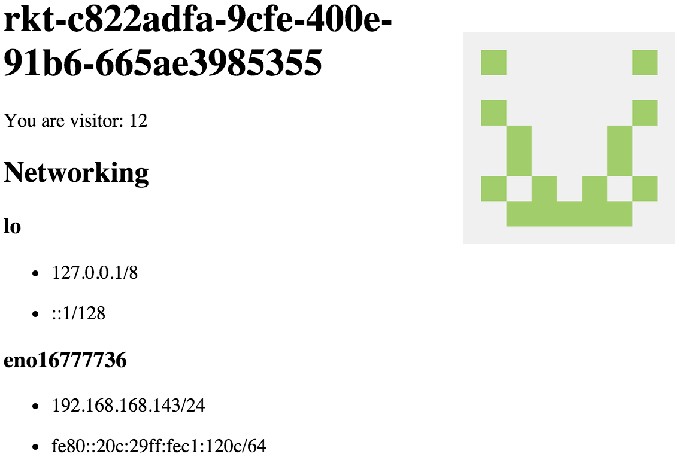

## Simple Host Info

[](https://quay.io/repository/philips/host-info)


```
kubectl run --image=quay.io/philips/host-info:latest host-info
kubectl expose deployment host-info --session-affinity=None --port 8080
```

```
kubectl proxy
```

Visit http://localhost:8001/api/v1/proxy/namespaces/default/services/host-info/



