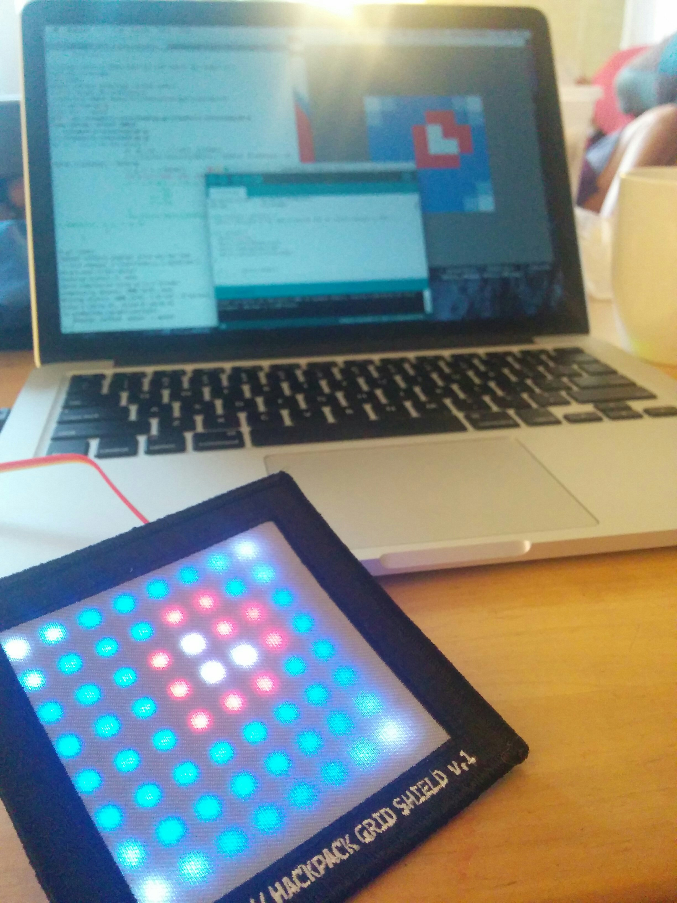

## CoreOS Neomatrix Logo

Arduino project to print the CoreOS logo onto a Neomatrix display. Thanks to Twilio for the [hackpack](https://www.twilio.com/blog/2015/05/light-up-your-hackpack-with-the-adafruit-neomatrix-library.html).


```
go run png2rgb.go  coreos.png | pbcopy
```


TODO

- Use templates to build the ino file instead of pbcopy
- Animation!



